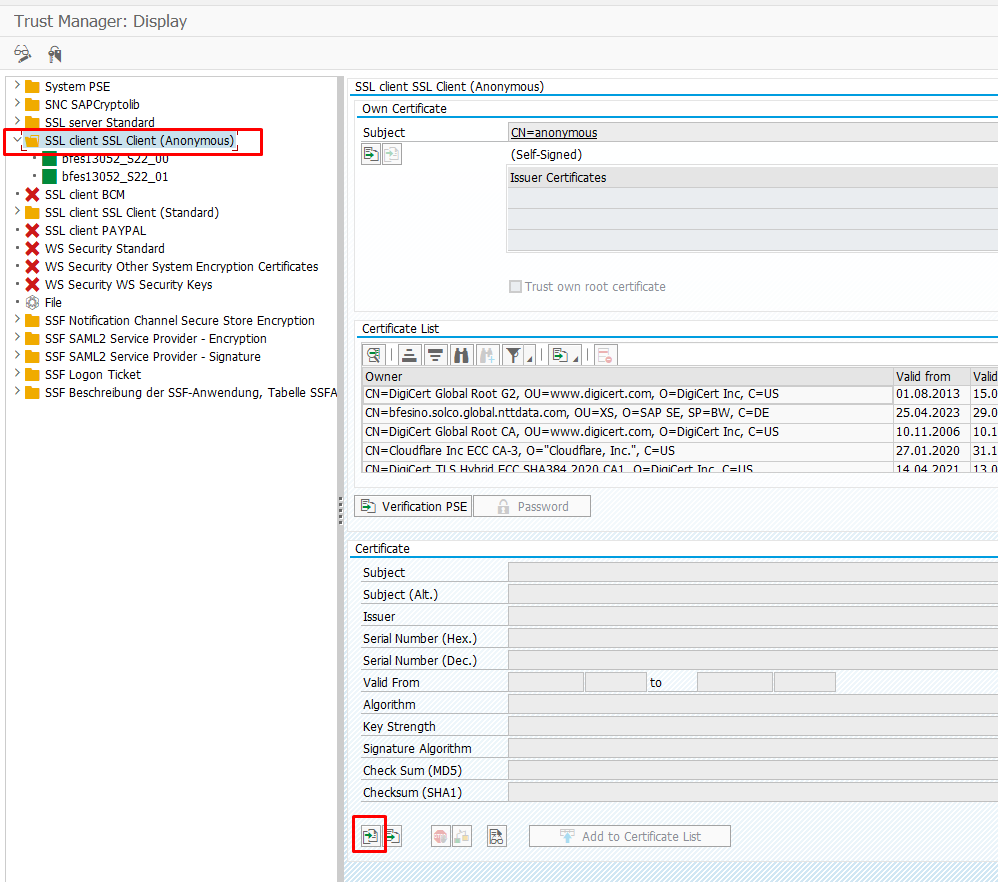
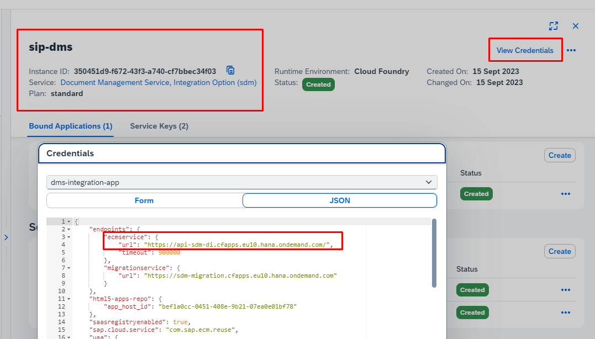
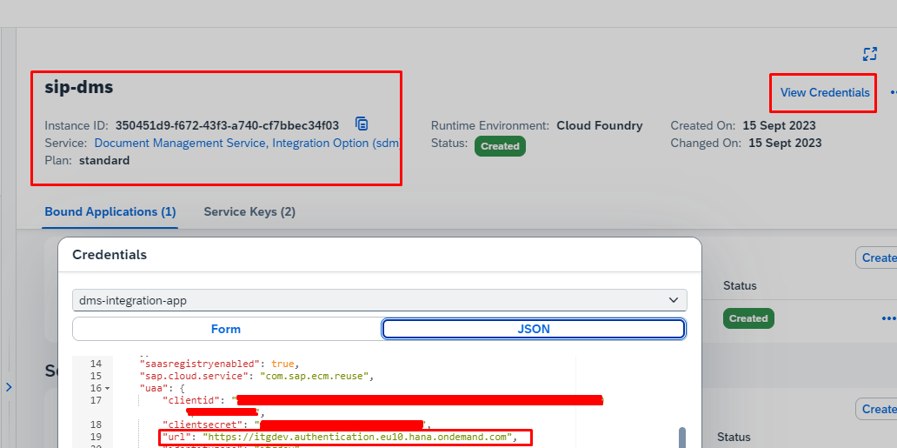

# btp-dms-abap-engine
ABAP Class and Report for uploading files into BTP Document Management Service Integration Option

# Steps to run the report and class

1) Download BTP SSL certificate from subaccount and import it into the system via STRUST transaction code.

2) Create a Document Management Service, Integration Option service instance on BTP Subaccount Space and create a service key.
3) Get the API url and XSUAA URL, Client ID, Client Secret from the service instance which was created in step 2.

