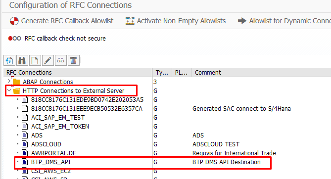

# btp-dms-abap-engine
ABAP Class and Report for uploading files into BTP Document Management Service Integration Option

# Steps to run the report and class

1) Download BTP SSL certificate from subaccount and import it into the system via STRUST transaction code.

2) Create a Document Management Service, Integration Option service instance on BTP Subaccount Space and create a service key.
3) Get the API url from the service instance which was created in step 2.

4) Get the XSUAA URL, Client ID, Client Secret from the service instance which was created in step 2.

5) Create OAuth 2.0 Client Profile via SE80 (right click on the package -> create -> others -> OAuth 2.0 Client Profile

6) Create OAuth 2.0 Client via OA2C_CONFIG transaction code. Select the client profile which was created in step 5 and put in the information (step 4) below.

   - Authorization Endpoint = XSUAA URL + /oauth/authorize
   - Token Endpoint = XSUAA URL + /oauth/token
   - OAuth 2.0 Client ID = XSUAA Client ID
   - OAuth 2.0 Client Secret = XSUAA Client Secret
   - Client Authentication = Basic
   - Resource Access Authentication = Header Field
   - Selected Grant Type = Client Credentials

7) Create a destination with type G (HTTP to external) via SM59 with the information below.

   - Technical Settings -> Host = API URL which was retrieved in step 3
   - Technical Settings -> Port = 443
   - Technical Settings -> Proxy = Optional (depends on the system)

  - Logon & Security -> OAuth Settings -> Select the OAuth 2.0 Client which was created in step 6.
  - Logon & Security -> SSL = Active, SSL Certificate = Anonymous

8) Copy ABAP class and report
